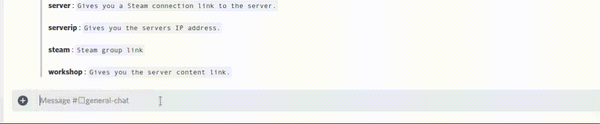

# cppbot
Discord bot written in C++ with the SleepyDiscord library. You can customize it as you like and
create custom bot commands!

### Installation 
Installing and compiling the bot is easy with the install script. 
`wget https://raw.githubusercontent.com/E-Almqvist/cppbot/master/install.sh && sudo sh install.sh /path/to/bot BOT_NAME`
Where `/path/to/bot` needs to be an existing directory and `BOT_NAME` will be the bots name. 
You will need *git*, *sudo* and *wget* to install the bot. You will need *cmake*, *GCC* (compiler) and *make* to compile the bot. 

### Manual Installation
Literally just clone the repository and compile everything yourself. 

### Setup 
Go into your bots directory and create two files `bot.id` and `bot.token` in `Builds/`.
Then go to your Discord application and copy your bots secret token and put it into `Builds/bot.token`.
Then put your bots ID into `Builds/bot.id`. **Filenames are case-sensitive!**

#### Manual Installation Setup
Copy your bots token and ID and put them into their respective file (`bot.id` and `bot.token`).
These files should be located where you compiled the bot.

### Usage
If you installed the bot via the installation script then you can start the bot via the start
script. The start script is located in the bots root directory.
###### Example:
`sudo sh start.sh`

### Dependencies

Sleepy Discord: https://github.com/yourWaifu/sleepy-discord/tree/develop

C++ JSON: https://github.com/nlohmann/json
